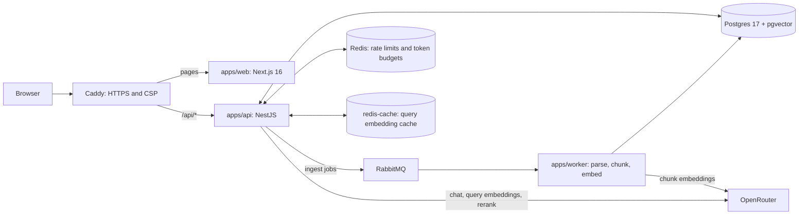

# ClauseCite

[](https://github.com/varunsudrik/clausecite-insurance-rag/actions/workflows/ci.yml)

**A RAG copilot for health-insurance policies: it answers questions with clause-level citations and refuses when the policies do not contain the answer.**

Status: Phase 1 (ingestion, hybrid retrieval, cited streaming chat, the web UI and the production deploy tooling) is implemented. Phase 2 (evaluation harness, agent mode, MCP server, tracing) is next; see the [Roadmap](#roadmap). There is no public demo URL yet.

## What it does

- **Ingests policy PDFs asynchronously.** An admin uploads a PDF and a RabbitMQ worker parses it with pdf.js, rebuilds its section and clause structure, and stores clause-level chunks with page ranges and embeddings in Postgres/pgvector.
- **Answers with clause-level citations.** Answers stream back with `[n]` markers. Clicking one shows the cited clause with its policy, section path and pages, and opens the source PDF at the cited page with the passage highlighted. A question can be scoped to selected policies or asked across all of them.
- **Refuses instead of guessing.** When no retrieved clause clears the rerank threshold, no answer is generated. The user gets a fixed "not found" answer plus up to three of the closest clauses.

Visitors chat without signing up (a guest token is issued on the first visit); only the admin can upload.

**Demo corpus.** Twelve public Indian health-insurance policy wordings from ten insurers are listed in [`data/sources.json`](data/sources.json) and recorded by sha256 in [`data/sources.lock.json`](data/sources.lock.json). The PDFs themselves are downloaded to the git-ignored `data/pdfs/sources/` and never committed. A count in the local dev database on 2026-10-03 (the synthetic test fixture excluded) gave 12 documents, 467 pages and 1,234 chunks. The 1,234 stored chunks total about 379k tokens (cl100k_base, `sum(chunks.token_count)`), which is about $0.008 to embed at text-embedding-3-small's $0.02 per 1M tokens list price.

## Architecture



The browser loads the Next.js app and calls the API through Caddy at `/api`. In local development there is no Caddy: the web app on port 3000 calls the API on port 3001 directly. The API and the worker share one PDF storage directory, a named volume in production. Shared domain code (ingest, retrieval, generation, db, queue, config) lives in `packages/core`, so both apps run the same code paths.

### Ingest path

1. `POST /documents` (admin, multipart, up to 20 MB) checks the `%PDF-` magic bytes and hashes the file. An identical upload returns the existing document. Otherwise the API writes `<sha256>.pdf` to storage, inserts a `queued` row and publishes `{ documentId, attempt: 0 }` on a RabbitMQ confirm channel.
2. The worker (prefetch 2) extracts positioned text with pdf.js, rebuilds lines, drops repeated headers and footers, sanitizes the text and rejects PDFs without a text layer.
3. It builds a section tree from the detected headings, chunks it per clause, and embeds the chunks in batches of 100.
4. One transaction locks the document row, replaces its chunks and marks it `ready`. The message is acked after the commit.
5. A retryable failure, such as an embedding outage, goes to a delayed retry queue (10 s, 60 s, then 300 s). A non-retryable failure, or the last retry, marks the document `failed` with an error code and dead-letters the job.

### Ask path

1. `POST /chat` carries one message, an optional `conversationId` and an optional `documentIds` scope. The server reloads the history from Postgres ([DECISIONS 010](DECISIONS.md#010--chat-request-carries-one-message-the-server-owns-history)).
2. Redis enforces per-user and per-IP rate limits and the per-guest and global daily token budgets. All of them fail closed.
3. A follow-up is rewritten into a standalone question using the last six messages; a first question is used as is.
4. The query embedding is looked up in `redis-cache` or computed. Hybrid SQL returns up to 30 candidates, and Cohere rerank keeps at most 6 that score at least `RERANK_THRESHOLD` (0.2).
5. If none pass, the API streams the refusal with suggestions and skips answer generation. Otherwise the chat model streams an answer from numbered `<source>` blocks.
6. The stream sends `data-sources` first, then the text, then a `data-meta` part with the validated answer and citations. The message is stored with its citations, token usage, the cost OpenRouter reports, and per-stage latency.

## How retrieval works

- **Structure-aware chunking.** Headings are detected from numbering patterns, larger or bold fonts and short all-caps lines, and gated against body text. A cross-reference such as "Section 45 of the Insurance Act" or a wrapped number such as "1.5 times the sum insured" does not start a fake clause ([DECISIONS 007](DECISIONS.md#007--heading-detection-is-gated-against-body-text)). List markers like `(i)` and `(a)` stay inside their clause, so an enumeration keeps its lead-in sentence ([DECISIONS 003](DECISIONS.md#003--list-markers-are-body-text)). Each leaf clause becomes one chunk. Clauses over 600 tokens are split at sentence boundaries with an 80-token overlap, and adjacent short siblings (under 120 tokens) are merged. Every chunk is embedded and full-text indexed with a contextual header, `{product} ({insurer}) › {section path} › {clause title}`.
- **Hybrid search with RRF.** One SQL statement takes the top 30 by pgvector cosine distance (HNSW) and the top 30 by Postgres full-text rank (`websearch_to_tsquery`, GIN index), then fuses them with Reciprocal Rank Fusion (k = 60). The vector side orders and limits in an inner subquery and ranks outside it, so the HNSW index is used instead of a sequential scan ([DECISIONS 002](DECISIONS.md#002--index-friendly-hybrid-sql)). `hnsw.iterative_scan = relaxed_order` keeps a policy-scoped search returning a full candidate list. An empty scope matches nothing; it never falls back to all policies.
- **Rerank.** The candidates go to `cohere/rerank-v3.5` through OpenRouter's rerank endpoint with a 3 s timeout. If rerank fails, the top 6 by RRF are used and the response is flagged `rerankDegraded`.
- **Refusal gate.** If nothing clears the threshold, or retrieval finds nothing, the answer is a fixed refusal plus up to three of the closest clauses, stored with `status=refused`. Answer generation is skipped.
- **Citation validation.** The prompt requires an `[n]` on every factual claim and treats source text as untrusted. After the stream ends, markers that point at sources the server did not provide are removed and logged as `invalid_citation`. `[n, m]` is normalized to `[n][m]`, and the stored citations are the valid ones in order of first use. An answer left with no valid citation is marked uncited.
- **Supporting decisions.** Query embeddings are cached in a separate, memory-bounded Redis so that cache growth can never evict rate-limit or budget keys ([DECISIONS 009](DECISIONS.md#009--embedding-cache-on-its-own-bounded-redis)). Re-ingesting a document replaces its chunks under a row lock ([DECISIONS 006](DECISIONS.md#006--lock-the-document-row-during-chunk-replace)).

## Engineering highlights

- **Per-delay retry queues.** Each delay gets its own `ingest.document.retry.<ms>` queue with a queue-level TTL. RabbitMQ expires only the head of a queue, so on a shared queue a 300 s message would block the 10 s retries behind it ([DECISIONS 001](DECISIONS.md#001--one-retry-queue-per-delay)). [`packages/core/src/queue/topology.ts`](packages/core/src/queue/topology.ts)
- **Row lock against duplicate chunks.** The chunk-replace transaction starts with `SELECT … FOR UPDATE` on the document row, so a redelivery that overlaps a running ingest cannot interleave delete and insert. Without the lock, a test reproduced 12 chunks instead of 6 ([DECISIONS 006](DECISIONS.md#006--lock-the-document-row-during-chunk-replace)). [`packages/core/src/ingest/ingest-document.ts`](packages/core/src/ingest/ingest-document.ts)
- **`dist + 0` exact ranking under relaxed HNSW.** With `relaxed_order` the index may emit rows slightly out of order, so the vector rank is computed over `ORDER BY dist + 0`, which forces a real sort of the (at most 30) candidates. An integration test pins this with `ef_search = 1`. [`packages/core/src/retrieval/search.ts`](packages/core/src/retrieval/search.ts)
- **Prompt-injection escaping.** Every `<` and `>` in retrieved text is escaped, so a PDF cannot close or forge a `<source>` tag. Attribute values are escaped too, with control and line-separator characters flattened. [`packages/core/src/generation/prompts.ts`](packages/core/src/generation/prompts.ts)
- **Fail-closed limits with a global spend cap.** Redis holds per-user and per-IP rate windows (IPv6 bucketed by /64) and per-guest and deployment-wide daily token budgets. A Redis error or a non-numeric counter rejects the request. Every search, and every chat that reaches retrieval (answered or refused), also pays a flat token charge ([DECISIONS 012](DECISIONS.md#012--spend-protection-is-a-phase-1b-deploy-gate-implemented)). [`apps/api/src/limits/limits.service.ts`](apps/api/src/limits/limits.service.ts)
- **Crash-only worker vs reconnecting API publisher.** The worker exits on broker loss and lets Docker restart it ([DECISIONS 004](DECISIONS.md#004--plain-amqplib-with-a-crash-only-worker)). The API connects lazily, shares one connect attempt, times out after 5 s and reconnects on next use ([DECISIONS 011](DECISIONS.md#011--api-currently-crash-only-on-broker-loss-resolved-in-phase-1b)). During a broker outage, chat, search and document reads keep working. New uploads and re-ingest answer 503, and `/health` answers 503 `degraded` with `rabbitmq: false`. [`apps/api/src/infra/rabbit-publisher.ts`](apps/api/src/infra/rabbit-publisher.ts), [`apps/worker/src/worker.module.ts`](apps/worker/src/worker.module.ts)
- **pdf.js text sanitization.** One policy in the corpus maps the "ffi" ligature to U+0000, which Postgres `text` rejects. Extracted text is NFKC-normalized and stripped of control characters. Postgres data errors (SQLSTATE class 22) become a non-retryable `CHUNK_DATA_INVALID`, so they are not retried. [`packages/core/src/ingest/text-sanitize.ts`](packages/core/src/ingest/text-sanitize.ts), [`packages/core/src/ingest/errors.ts`](packages/core/src/ingest/errors.ts)
- **Citations open the PDF at the cited page.** react-pdf renders the file with the user's bearer token. A custom text renderer marks the PDF text items that occur in the cited passage, on the cited pages only, and HTML-escapes every item. [`apps/web/src/components/pdf-viewer.tsx`](apps/web/src/components/pdf-viewer.tsx), [`apps/web/src/lib/highlight.ts`](apps/web/src/lib/highlight.ts)
- **Deploys exactly the commit CI tested.** Under `workflow_run`, the deploy builds and tags images from `workflow_run.head_sha`, not the branch tip. It refuses any run that was not a push to this repository, such as a pull request from a fork's `main`. [`.github/workflows/deploy.yml`](.github/workflows/deploy.yml)
- **Crash-safe backups.** The daily `pg_dump` writes to a temporary file that is renamed only on success, so a failed run never replaces the last good dump. A healthcheck turns unhealthy when the newest dump is missing, empty or older than 26 h. [`docker-compose.prod.yml`](docker-compose.prod.yml)

## Tech stack

| Area           | Choice                                                                                                                                                  |
| -------------- | ------------------------------------------------------------------------------------------------------------------------------------------------------- |
| Monorepo       | pnpm 10 workspaces, Turborepo 2, TypeScript 6 (ESM)                                                                                                     |
| API            | NestJS 12 on Express, zod validation, helmet, argon2 password hashing, HS256 JWTs                                                                       |
| Worker         | NestJS 12 application context, `amqplib` confirm channels                                                                                               |
| Web            | Next.js 16 (App Router), React 19, Tailwind CSS 4, AI SDK `useChat`, react-pdf                                                                          |
| LLM access     | Vercel AI SDK 7 with `@openrouter/ai-sdk-provider`; OpenRouter's rerank endpoint for Cohere                                                             |
| Default models | chat `anthropic/claude-haiku-4.5` (fallback `openai/gpt-4.1-mini`), embeddings `openai/text-embedding-3-small` (1536 dims), rerank `cohere/rerank-v3.5` |
| Database       | PostgreSQL 17 with pgvector (HNSW, cosine) and a generated `tsvector` (GIN), Drizzle ORM and drizzle-kit migrations                                     |
| Queue          | RabbitMQ 3.13: direct exchanges, per-delay retry queues, a dead-letter queue                                                                            |
| Cache, limits  | Redis 7 (`ioredis`): one instance for limits and budgets, one bounded LRU instance for the embedding cache                                              |
| PDF            | `pdfjs-dist` for parsing, `js-tiktoken` (`cl100k_base`) for token counts                                                                                |
| Tests          | Vitest 4, Testing Library, supertest, Testcontainers                                                                                                    |
| Tooling        | oxlint, Prettier, GitHub Actions                                                                                                                        |
| Deploy         | Docker images on `node:24-bookworm-slim`, Docker Compose, Caddy 2, GHCR                                                                                 |

All models are reached through OpenRouter with one key and are set by env vars (`CHAT_MODEL`, `CHAT_FALLBACK_MODELS`, `EMBEDDING_MODEL`, `RERANK_MODEL`).

## Repository layout

```
apps/api        NestJS HTTP API: auth, documents, search, chat (SSE), limits, health
apps/worker     NestJS RabbitMQ consumer: ingest jobs, retries, dead-lettering
apps/web        Next.js UI: chat, citation panel, PDF viewer, policies, admin upload
packages/core   shared code: config, db (Drizzle), ingest, llm, retrieval, generation, queue
data            sources.json and sources.lock.json (policy URLs and hashes), a synthetic test PDF
scripts         download and ingest the demo policies, re-embed, model and prod-stack smoke tests
docker          Dockerfiles and the Caddyfile
DECISIONS.md    architecture decision log
docs            deploy guide, design spec and implementation plans
```

## Run it locally

**Prerequisites:** Node.js 22.18 or later (CI and the Docker images use 24), pnpm through Corepack (`corepack enable`; the pnpm version is pinned by the `packageManager` field), Docker with Compose v2, and an [OpenRouter](https://openrouter.ai/keys) API key.

```bash
corepack enable
cp .env.example .env
```

Fill in three values in `.env`. The rest already matches the local Docker Compose services.

- `OPENROUTER_API_KEY`: your OpenRouter key.
- `JWT_SECRET`: generate one with `openssl rand -base64 48`. The API refuses a secret shorter than 32 characters.
- `ADMIN_PASSWORD`: at least 12 characters. The API will not seed the admin with the placeholder. `ADMIN_EMAIL` defaults to `admin@clausecite.local`.

```bash
pnpm install
pnpm infra:up      # Postgres :5433, RabbitMQ :5672 (UI :15672), Redis :6379, redis-cache :6380
pnpm db:migrate
pnpm build
```

Run the three apps, each in its own terminal:

```bash
pnpm --filter @clausecite/worker start   # consumes ingest jobs
pnpm --filter @clausecite/api start      # http://localhost:3001
pnpm --filter @clausecite/web dev        # http://localhost:3000
```

Load the demo policies:

```bash
pnpm sources:download            # to data/pdfs/sources/; files matching the lock are skipped, others downloaded and re-pinned
git diff data/sources.lock.json  # empty unless a PDF or its URL changed since the lock was recorded
pnpm sources:ingest              # checks each PDF against its locked sha256, uploads as the admin, waits for ready or failed
```

Open http://localhost:3000. `pnpm infra:down` stops the containers.

## Testing

```bash
pnpm test        # unit tests: no Docker, mock models
pnpm test:int    # integration tests: needs Docker (Testcontainers, random host ports)
```

- **`pnpm test`** covers PDF line rebuilding, heading detection and chunking, text sanitization, prompt escaping, citation validation, history sanitizing and question rewriting, the rerank client, the retrieval orchestration (refusal gate, rerank fallback), the embedding cache and queue topology, env validation, the API's guards, limits, client-IP bucketing, health and reconnecting publisher, the worker's retry logic, the web components and client libraries (chat view, citation panel, PDF viewer, policy scope, upload form, session, chat transport, highlighting), and the lockfile and API-URL helpers in `scripts/`.
- **`pnpm test:int`** runs against real Postgres/pgvector, RabbitMQ and Redis containers. It covers the schema and indexes, an end-to-end ingest of the fixture PDF (idempotent re-ingest, the row lock under overlapping ingests, error classification, rollback), hybrid SQL (RRF fusion, document scoping, exact ranking under relaxed HNSW), re-embedding, the worker's retry and dead-letter flow on a real broker, and API end-to-end tests: auth and forged tokens, uploads, chat streaming and refusals, search, rate limits and budgets, `TRUST_PROXY_HOPS`, and `/health` with the broker down.

Every test uses mock models, so neither command needs an OpenRouter key. CI runs build, lint, typecheck, format check, `pnpm test` and `pnpm test:int` on every push and pull request ([`.github/workflows/ci.yml`](.github/workflows/ci.yml)).

Test counts as printed by each package's Vitest run on 2026-10-03, 473 unit and 146 integration tests in total:

| Package              | `pnpm test`           | `pnpm test:int`     |
| -------------------- | --------------------- | ------------------- |
| `@clausecite/core`   | 197 tests in 17 files | 41 tests in 5 files |
| `@clausecite/api`    | 116 tests in 11 files | 95 tests in 8 files |
| `@clausecite/worker` | 6 tests in 1 file     | 10 tests in 2 files |
| `@clausecite/web`    | 134 tests in 18 files | none                |
| root `scripts`       | 20 tests in 2 files   | none                |

## Deploying

[`docs/deploy.md`](docs/deploy.md) is the full guide. In short, one VM runs `docker-compose.prod.yml`: Caddy (automatic HTTPS, a Content-Security-Policy on the web routes, HSTS) in front of the web app and the API, plus Postgres/pgvector, RabbitMQ, both Redis instances, the worker, a one-shot migration job and the daily backup. When CI passes on a push to `main`, [`deploy.yml`](.github/workflows/deploy.yml) builds the three images, pushes them to GHCR tagged with the commit sha, and rolls the server forward over SSH with a health-check smoke test. Deploys stay off until the repository variable `DEPLOY_ENABLED` is `true`.

Before going public, set a credit limit on the OpenRouter key. It is a manual step (step 0 of the guide) and the only spend bound that does not depend on application code ([DECISIONS 012](DECISIONS.md#012--spend-protection-is-a-phase-1b-deploy-gate-implemented)).

## Roadmap

Phase 2, from the [design spec](docs/superpowers/specs/2026-10-03-clausecite-design.md):

- **Evaluation harness, gated in CI.** A hand-verified golden set and per-strategy retrieval metrics (Hit@k, Recall@k, MRR for vector, full-text, hybrid and hybrid + rerank). LLM-judged faithfulness, correctness and citation precision, plus refusal accuracy on unanswerable questions.
- **Agent ("Deep") mode.** Tool calling over `list_policies`, `search_policies`, `get_clause` and `get_definition`, for questions that need to follow "subject to Clause X" references.
- **MCP server.** The same tools over stdio and Streamable HTTP, as a thin client of the API so its auth, limits and budgets still apply.
- **Tracing and telemetry.** OpenTelemetry with a Langfuse exporter, plus per-stage latency, cost and cache-hit statistics.
- **Feedback loop.** Thumbs up or down on answers, with downvoted questions drafted into the golden set for review.

This README makes no accuracy, recall, faithfulness or latency claims. Those numbers will be published from the eval reports once the harness runs.

## Data notice

The policy wordings belong to their insurers. They are publicly available documents, used here for demonstration only, and this repository does not redistribute them: it stores only their URLs and hashes. ClauseCite's answers are not insurance, legal or financial advice. Always verify against your policy schedule and the insurer's latest wording.
